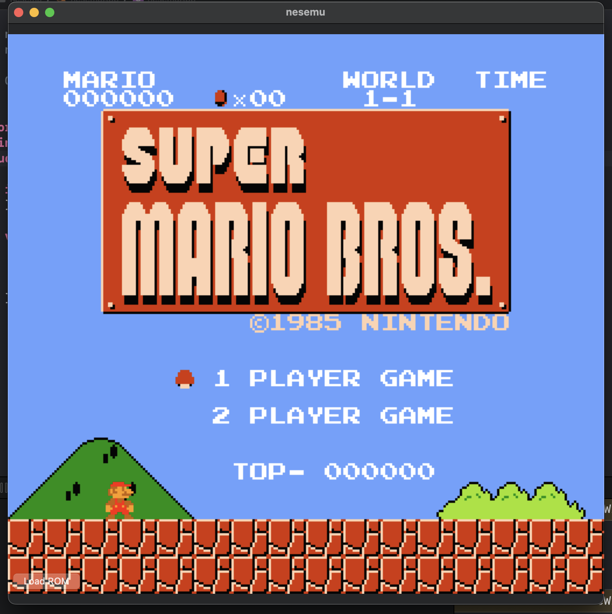
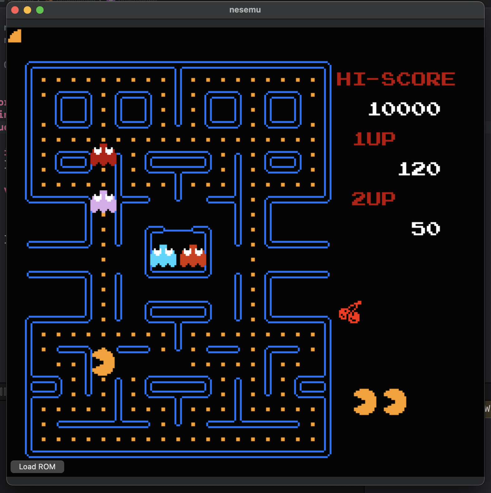

# NES Emulator in Swift

This is yet another NES emulator developed in Swift, leveraging Apple's Metal framework to render output frames. I embarked on this project to gain fundamental understanding of Swift and bit manipulation, while also fulfilling a childhood dream of creating my own emulator—because, let's face it, emulators are just cool.

While the emulator is functional and playable, it is still a work in progress. Some of the intricate details and edge cases related to the 6502 CPU and PPU (Picture Processing Unit) haven't been fully addressed yet. The Audio Processing Unit (APU) has not been implemented.

At the moment, the emulator is compatible only with NES V1 cartridges (ROMs), but there's plenty more to come as I continue to develop it in my free time.
